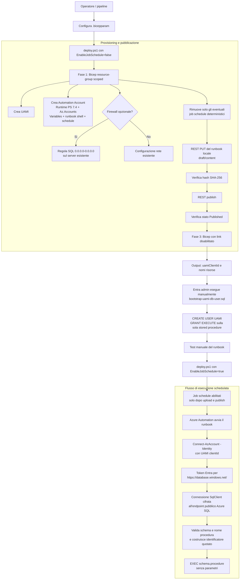

# Azure Automation SQL Scheduler

Template riutilizzabile per eseguire, tramite Azure Automation, una stored
procedure senza parametri su un database Azure SQL esistente. L'autenticazione
usa esclusivamente una User Assigned Managed Identity (UAMI) e un token
Microsoft Entra ID: non sono presenti password, connection string con
credenziali o secret.

Il template non crea il logical server o il database Azure SQL e
`deploy.ps1` non esegue mai lo script SQL di bootstrap.

## Risorse create

- User Assigned Managed Identity;
- Automation Account con la UAMI assegnata;
- Runtime Environment PowerShell 7.4;
- solo il package necessario Az.Accounts `4.2.0`, importato esplicitamente
  (versione e URI parametrizzabili);
- Automation Variables non cifrate per FQDN SQL, database, stored procedure e
  client ID UAMI (sono configurazioni, non secret);
- runbook PowerShell collegato al Runtime Environment;
- schedule OneTime, Daily, Weekly o una collezione lun-ven a cadenza oraria
  dentro una finestra configurabile;
- uno o più job schedule opzionali che collegano schedule e runbook;
- opzionalmente, regola firewall `0.0.0.0-0.0.0.0` sul logical server SQL
  esistente.

Non viene creata alcuna role assignment Azure per la UAMI. La runtime identity
non riceve quindi privilegi di deployment o di gestione Azure; nel database
riceve solo `EXECUTE` sulla singola stored procedure.

## Diagramma di flusso



La freccia verso il bootstrap SQL è volutamente esterna a `deploy.ps1`: la
creazione dell'utente contenuto è un'operazione data-plane separata e deve
essere eseguita da un Entra administrator.

## Struttura

```text
AutomationSqlScheduler/
|-- main.bicep
|-- deploy.ps1
|-- modules/
|   |-- automationAccount.bicep
|   |-- managedIdentity.bicep
|   |-- schedule.bicep
|   `-- sqlFirewallRule.bicep
|-- params/
|   |-- all-parameters.bicepparam
|   |-- onetime.bicepparam
|   |-- daily.bicepparam
|   |-- weekly.bicepparam
|   `-- weekdays-hourly-window.bicepparam
|-- runbooks/
|   `-- Invoke-SqlStoredProcedure.ps1
`-- sql/
    `-- bootstrap-uami-db-user.sql
```

## API usate

| Risorsa | API |
|---|---|
| Automation Account, Runtime Environment, package, variabili, runbook, schedule e job schedule | `2024-10-23` |
| User Assigned Managed Identity | `2024-11-30` |
| SQL server esistente e firewall rule | `2023-08-01` |

Per il runbook associato a un Runtime Environment PowerShell 7.4 viene usato
`runbookType: PowerShell` e `runtimeEnvironment: <nome>`. Il codice non viene
inserito inline in Bicep: l'API ARM del runbook accetta un content link, non
contenuto inline. `deploy.ps1` usa invece le API REST `draft/content` e
`publish` con il file locale.

## Prerequisiti

- Azure CLI `2.53.1` o successiva, con Bicep CLI disponibile tramite
  `az bicep`;
- PowerShell 7 per eseguire `deploy.ps1`;
- sessione Azure CLI già autenticata; lo script non esegue `az login` e non
  apre prompt interattivi;
- resource group di destinazione già esistente;
- subscription di deployment e SQL accessibili nello stesso tenant Entra
  della UAMI (lo scope SQL può essere in una subscription diversa);
- provider `Microsoft.Automation`, `Microsoft.ManagedIdentity` e
  `Microsoft.Sql` registrati nelle subscription interessate;
- logical server e database Azure SQL già esistenti e con endpoint pubblico
  abilitato;
- Microsoft Entra administrator configurato sul logical server SQL;
- stored procedure senza parametri già presente nel database.

### Permessi del principal che esegue `deploy.ps1`

Il principal di deployment deve poter:

1. creare/aggiornare UAMI, Automation Account e relative risorse nel resource
   group di deployment;
2. sostituire il draft e pubblicare il runbook
   (`Microsoft.Automation/automationAccounts/runbooks/*`);
3. se la regola firewall è abilitata, creare/aggiornare
   `Microsoft.Sql/servers/firewallRules` nel resource group SQL, anche quando
   questo si trova in un'altra subscription.

`Contributor` sui resource group interessati copre queste operazioni. In
ambienti con custom role, concedere solo le action specifiche sopra indicate.
La UAMI del runbook non necessita di tali permessi.

## Configurazione

Scegliere e copiare uno degli esempi:

- `params/all-parameters.bicepparam`: esempio completo con **tutti** i
  parametri di `main.bicep`, ognuno accompagnato da descrizione e indicazioni
  d'uso;
- `params/onetime.bicepparam`: singolo slot;
- `params/daily.bicepparam`: ogni `scheduleInterval` giorni;
- `params/weekly.bicepparam`: ogni `scheduleInterval` settimane nei giorni
  indicati in `scheduleWeekDays`;
- `params/weekdays-hourly-window.bicepparam`: dal lunedì al venerdì, ogni ora
  dentro una finestra inclusiva configurabile.

Aggiornare almeno:

- naming, location, tag e SKU;
- `sqlSubscriptionId`, `sqlResourceGroupName`, `sqlServerName`,
  `sqlDatabaseName`;
- `storedProcedureName`, preferibilmente sempre in formato
  `schema.procedure`;
- `scheduleStartTime`, che deve essere nel futuro e includere l'offset;
- `scheduleTimeZone`, interval e weekDays;
- scelta firewall;
- versioni/URI dei package, se si decide di modificarle.

Il FQDN SQL usa per default il suffisso del cloud Azure corrente tramite
`environment().suffixes.sqlServerHostname`, ma può essere sovrascritto con
`sqlServerFqdn`.

### Lunedì-venerdì, ogni ora in una finestra

Azure Automation non permette di combinare in una singola schedule nativa:

- più giorni della settimana;
- ricorrenza oraria;
- ora minima e massima giornaliera.

Con `scheduleMode='WeekdayHourlyWindow'` il template crea quindi una schedule
`Week` per ciascuna ora della finestra. Per esempio:

```bicep
param weekdayHourlyWindowStartHour = 8
param weekdayHourlyWindowEndHour = 18
param weekdayHourlyWindowMinute = 0
```

genera **11 slot inclusivi**: 08:00, 09:00, ..., 18:00. I nomi diventano
`<scheduleName>-0800`, `<scheduleName>-0900`, ..., `<scheduleName>-1800`.
Tutti gli slot usano:

- `weekdayHourlyWindowWeekDays`, per default Monday-Friday;
- `scheduleInterval`, interpretato come intervallo in settimane (`1` = ogni
  settimana);
- `scheduleTimeZone` e `scheduleExpiryTime`;
- la stessa stored procedure e lo stesso runbook.

`weekdayHourlyWindowStartDate` deve essere una data futura appartenente ai
giorni configurati. `weekdayHourlyWindowUtcOffset` deve essere coerente con il
fuso in quella data; Azure Automation usa poi `scheduleTimeZone` per la
ricorrenza. La finestra non attraversa la mezzanotte: l'ora finale deve essere
maggiore o uguale a quella iniziale.

Il deployment genera GUID deterministici per tutti i link. La fase protetta di
`deploy.ps1` rimuove gli eventuali link candidati prima di ripubblicare il
runbook e l'ultima fase ricrea tutti e soli i link attivi.

### Stored procedure e protezione da SQL injection

Il runbook accetta come configurazione solo `procedure` oppure
`schema.procedure`. Ogni parte deve iniziare con lettera/underscore e può
contenere solo lettere, numeri e underscore. Dopo la validazione, ogni parte
viene racchiusa tra parentesi quadre e il comando eseguito è esclusivamente:

```sql
EXEC [schema].[procedure];
```

Non sono concatenati valori SQL e non vengono passati parametri alla stored
procedure.

## Ordine operativo consigliato

### 1. Preparare il file parametri

Gli esempi contengono nomi placeholder e date nel 2030. Sostituirli prima
dell'uso. In particolare, il logical server SQL deve esistere nello scope
indicato.

### 2. Creare risorse e pubblicare il runbook, lasciando disabilitato il link

```powershell
./deploy.ps1 `
  -SubscriptionId '<subscription-deployment>' `
  -ResourceGroupName '<resource-group-deployment>' `
  -ParametersFile './params/daily.bicepparam' `
  -EnableJobSchedule $false
```

Lo script:

1. valida Azure CLI, Bicep, i file e la sessione autenticata;
2. esegue un deployment resource-group scoped in modalità Incremental forzando
   `enableJobSchedule=false`;
3. rimuove in modo mirato gli eventuali link deterministici già esistenti
   (Incremental non eliminerebbe una risorsa condizionale omessa);
4. legge dagli output i nomi di Automation Account e runbook;
5. carica il file locale, attende la conferma dell'hash SHA-256 e pubblica il
   runbook;
6. esegue un secondo deployment mantenendo il link disabilitato.

Il runbook non dipende da URL pubblici. Solo il package Az.Accounts viene
importato dall'URI PowerShell Gallery parametrizzato.

### 3. Configurare l'Entra administrator SQL

Nel logical server SQL configurare un Microsoft Entra administrator. Collegarsi
quindi al **database target**, non a `master`, usando un'autenticazione Entra
(SSMS, Azure Data Studio o `sqlcmd -G`).

### 4. Eseguire manualmente il bootstrap SQL

Aprire `sql/bootstrap-uami-db-user.sql` e configurare il blocco iniziale con:

- nome della UAMI;
- `uamiClientId` restituito dagli output del deployment;
- schema e nome della stored procedure;
- `@UseSidFallback = 0` inizialmente.

Lo script crea l'utente contenuto e concede:

```sql
GRANT EXECUTE ON OBJECT::[schema].[procedure] TO [nome-uami];
```

Non assegna ruoli database né grant globali.

#### Alternativa `WITH SID ..., TYPE = E`

`CREATE USER ... FROM EXTERNAL PROVIDER` richiede che Azure SQL riesca a
risolvere la UAMI tramite Microsoft Graph. Se fallisce per impossibilità di
risoluzione, impostare `@UseSidFallback = 1` e usare il `clientId` reale della
UAMI. Per service principal e managed identity Azure SQL richiede infatti
l'application/client ID come SID, non il principal/object ID. Lo script
converte correttamente:

```sql
CONVERT(varbinary(16), CONVERT(uniqueidentifier, @UamiClientId))
```

e genera `CREATE USER ... WITH SID = 0x..., TYPE = E`, evitando la lookup
Graph. Non usare direttamente `CONVERT(VARBINARY(16), '<guid-testuale>')`,
perché produrrebbe un SID errato.

### 5. Abilitare il job schedule

Dopo il bootstrap, rieseguire:

```powershell
./deploy.ps1 `
  -SubscriptionId '<subscription-deployment>' `
  -ResourceGroupName '<resource-group-deployment>' `
  -ParametersFile './params/daily.bicepparam' `
  -EnableJobSchedule $true
```

La prima fase resta sempre protetta con link disabilitato; il collegamento
viene creato solo nell'ultima fase, dopo che l'hash del draft e lo stato
`Published` sono stati verificati. Il GUID del job schedule è deterministico,
quindi rieseguire lo script con gli stessi parametri è idempotente.

Per sospendere esecuzioni future senza eliminare le altre risorse, rieseguire
con `-EnableJobSchedule $false`.

## Firewall pubblico e sicurezza

`createAllowAzureServicesFirewallRule=true` crea la regola speciale Azure SQL
`0.0.0.0-0.0.0.0` ("Allow Azure services and resources to access this
server"). Questa regola è necessaria in molti scenari Azure Automation con
endpoint pubblico, ma **non** limita il traffico alle sole risorse della propria
subscription o tenant: rende l'endpoint raggiungibile dalla rete Azure in
generale. L'accesso resta protetto dall'autenticazione Entra e dai permessi SQL,
ma l'esposizione di rete è più ampia.

Se il server dispone già di una configurazione di rete adeguata, impostare il
parametro a `false`. Per isolamento forte, preferire Private Endpoint e Hybrid
Runbook Worker in una rete controllata; questo template implementa
intenzionalmente il requisito con endpoint pubblico.

## Test manuale

1. Lasciare il job schedule disabilitato.
2. Dal portale Azure aprire Automation Account > Runbooks >
   `Invoke-SqlStoredProcedure`.
3. Verificare che il Runtime Environment sia PowerShell 7.4 e avviare il
   runbook manualmente senza parametri.
4. Controllare l'output del job:
   - autenticazione UAMI riuscita;
   - connessione SQL aperta;
   - stored procedure eseguita;
   - job `Completed`.
5. Verificare nel database gli effetti applicativi attesi.
6. Solo dopo il test, abilitare il job schedule.

Il runbook non scrive mai il token nei log. In caso di errore termina in stato
failed con un messaggio esplicito.

## Validazione locale senza deployment

Questi comandi compilano/analizzano soltanto file locali:

```powershell
az bicep build --file ./main.bicep --stdout | Out-Null

Get-ChildItem ./params/*.bicepparam | ForEach-Object {
  az bicep build-params --file $_.FullName --stdout | Out-Null
}

$errors = $null
[System.Management.Automation.Language.Parser]::ParseFile(
  (Resolve-Path ./deploy.ps1),
  [ref]$null,
  [ref]$errors
) | Out-Null
$errors
```

Nessuno di questi comandi crea o modifica risorse Azure.
